# **Лабораторная работа №1**
## Задание 1
```python
print(f'Привет {input()}! Через год тебе будет {int(input()) + 1}')
```

## Задание 2 
```python
a, b = float(input()), float(input())
print(f'sum: {a + b}; avg: {(a + b) / 2}')
```
Функция Float - служит для хранения типа данных с плавающей точкой 

## Задание 3 
```python
price = float(input())
discount = float(input())
vat = float(input())

base = price * (1 - discount / 100)
vat_amount = base * (vat / 100)
total = base + vat_amount

print(f'База после скидки: {base}')
print(f'НДС: {vat_amount}')
print(f'Итого к оплате: {total}')
```
В данном случае base - это цена при скидке, а vat_amount - Цена после скидки с учетом НДС

## Задание 4 
```python
min = int(input())
print(f'{min//60}:{min % 60}')
```

## Задание 5
```python
fio = input()
con = [i for i in fio if i != ' ']
ini = [g for g in con if g.isupper()]
print(f'Инициалы: {"".join(ini)}')
print(f'Длина (символов): {len(con)}')
```
В коде я расписал два генератора. 
Первый - con - служит для удаления пробелов в строке. Если при пробежке по строке, геник видит пробел, он исключает его из последовательности.
Второй - ini - Служит для определения символа, если символ заглавный, то он остается в строке. 
Функция isupper - служит для выявления заглавной буквы.
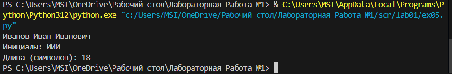
## Задание 6
```python
k = int(input())
och = 0
zaoch = 0
for i in range(0, k):
    n = (input().split())
    if 'True' in n:
        och += 1
    else:
        zaoch += 1
print(och, zaoch)
```
В данной задаче split - Разбивает введенные слова на элементы массива, после чего, с помощью генератора мы ищем подходящее слово в этом массиве.
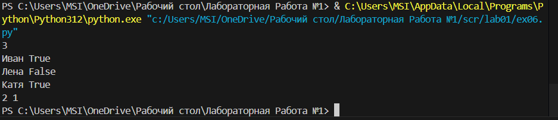
## Задание 7
```python
N = input()
con = 1
name = ''
for i in range(0, len(N)):
    if N[i].isupper():
        name += N[i]
        for j in range(i, len(N)):
            if N[j].isnumeric():
                for k in range(j + 1, len(N), con):
                    name += N[k]
                break
            con += 1
print(name)
```
Функция isupper - ищет заглавную букву в моем массиве, с помощью нее нахожу первую букву зашифрованного сообщения.
Функция isnumeric - ищет число, в моем случае я пробегаюсь от первой буквы моего зашифрованного слова и заканчивая длинной строки, затрагивая все возможные символы. Если следующий символ не цифра, то в таком случае мой счетчик повышается на 1, в задаче прямым текстом сказано, что символы моего зашифрованного слова находятся на определнном расстоянии друг от друга, чем я и пользуюсь.
Если я нахожу цифру, следовательно следующий элемент после цифры - элемент моего зашифрованного слова. 
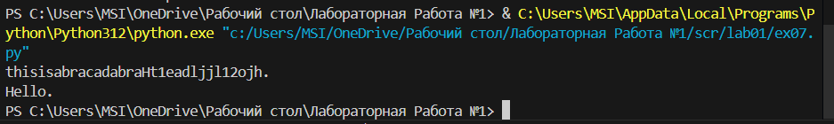
# **Лабораторная работа №2**
## Задание 1.1
```python
def min_max(nums: list[float | int]) -> tuple[float | int, float | int]:
    if len(nums)==0:
        raise ValueError
    minimum=min(nums)
    maximum=max(nums)
    return (minimum,maximum)
f=[1.5, 2, 2.0, -3.1]
s=min_max(f)
print(s)
```
Функция представленная на экране - возвращает два элемента массива из массива в котором имеется n - ое количество элементов.
функция берет максимальный и минимальный элемент массива и возвращает их.
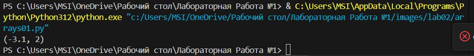
## Задание 1.2
```python
def unique_sorted(nums: list[float | int]) -> list[float | int]:
    if len(nums)==0:
        raise ValueError
    return sorted(set(nums))
f=[1.0, 1, 2.5, 2.5, 0]
s=unique_sorted(f)
print(s)
```
В данной задаче, ключевым моментом функции является функция sorted - Она вовращает отсортированный список начиная от наименьшего числа в массиве и заканчивая максимальным. 
Также использовал функцию set - она удаляет из множества одинаковые символы.
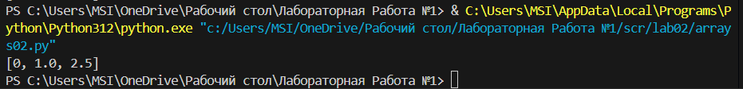
## Задание 1.3
```python
def flat(mat: list[list | tuple]) -> list:
    result=[]
    for i in mat:
        if not isinstance(i, (list, tuple)):
            raise TypeError    
        for g in i:
            if isinstance(g, (list, tuple)):
                raise TypeError
            result.append(g)
    return result
s=[[1], [], [2, 3]]
s=flat(s)
print(s)
```
В данной задаче я использую два цикла на проверку моеих массивов в массиве, Первый цикл проверяет, является ли данный элемент массивом в массиве, второй же проверяет не является ли элмент массивом в последовательности массивов в массиве. Далее по истечению проверки я возвращаю в новый массив значения прошлых значений в массиве. Немного запутанно, но пишу для себя :)

## Задание 2.1
```python
def transpose(mat):
    if not mat:
        return []
    row_length = len(mat[0])
    for p in mat:
        if len(p) != row_length:
            raise ValueError
    r = []
    for i in range(len(mat[0])):
        g = []
        for p in mat:
            g.append(p[i])
        r.append(g)
    return r
print(transpose([[1,2],[3,4]]))
```
В данной задачи я использовал два цикла, первый применялся для разбиения чисел строки на столбцы, второй , для сложения элементов столбцов в строки. Если длинна матрицы не совпадает с длинной строки - то пишу еррор.
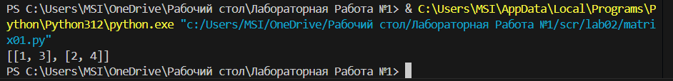
## Задание 2.2 
```python
def row_sums(mat: list[list[float | int]]) -> list[float]:
    result = []
    for i in mat:
        if len(i)<=1:
            raise TypeError
        i = sum(i)
        result.append(float(i))
    return result
s= [
    [1,2,3],
    [4,5,6]
    ]
f=row_sums(s)
print(f)
```
Пробегаюсь по массивам в массиве, если длинна элементов моего массива меньше двух, то выдаю ошибку, т.к рваная. После чего провожу сумму каждого массива и записываю в новый.
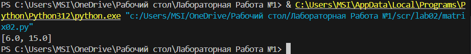
## Задание 2.3
```python
def col_sums(mat: list[list[float | int]]) -> list[float]:
    if len(mat) == 0:
        return []
    f = len(mat[0])
    for z in mat:
        if len(z) != f:
            raise ValueError
    r = len(mat)        
    k = len(mat[0])    
    a = [0.0] * k
    for col in range(k):      
        for row in range(r):  
            a[col] += mat[row][col]  
    
    return a
f=[[1,2,3],[4,5,6],[7,7,7]]
l=col_sums(f)
print(l)
```
Код пробегается по всем числам матрицы, начиная от mat[0][0] и заканчивая mat[n][m], Если длинна строки отличается от длинн остальных строк, то вывожу ошибку. Код работает с помощью цикла. Первый цикл, проходится по столбу, второй по строке, чтобы найти количество столбов я применяю функцию len(mat). когда второй цикл пробежится по всем числам строки, первый цикл поменяет индекс с [0]->[1] и так далее.
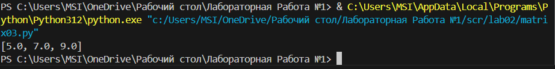
## Задание 3
```python
def format_record(rec: tuple[str, str, float]) -> str:
    fio, group, gpa = rec
    fio = fio.split()
    stroka = []
    for name in fio[1:]:
        i = f"{name[0].upper()}."
        stroka.append(i) 
    formatted_fio = f"{fio[0]} {' '.join(stroka)}"
    formatted_gpa = f"{gpa:.2f}"
    result = f"{formatted_fio}, гр. {group}, GPA {formatted_gpa}"
    return result
s=("Петров Пётр", "IKBO-12", 5.0)
f=format_record(s)
print(f)
```
В своем коде я разбиваю ФИО на массив состоящий из трех элементов Ф,И,О Позже так будет проще искать нужные буквы. Создаю цикл с помощью которого пробегаюсь по имени и отчеству, с его помощи я беру первую букву Имени, и приписываю ее к фамилии. 
gpa:.2f - делает два знака после запятой. 
в результат записываю исзодную строку которая должна получится.
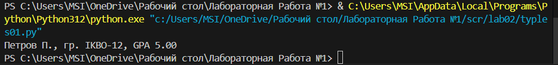
### Лабораторная работа №3 ###
## Задание A.1
```python
def normalize(text: str, *, casefold: bool = True, yo2e: bool = True) -> str:
    for i in '\n\t\r':
        text = text.replace(i," ")
    if yo2e==True:
        text = text.replace("ё","е").replace("Ё","Е")
    if casefold:
        text = text.casefold()
    while "  " in text:
        text = text.replace("  ", " ")
    return text.strip()
print(normalize("ПрИвЕт\nМИр\t"))
print(normalize("ёжик, Ёлка"))
print(normalize("Hello\r\nWorld"))
print(normalize("  двойные  пробелы  "))
```
Разберем начальную строчку. Если yo2e - True, то заменяю все "ё" и "Ё" на "е" и "Е", используя replace. Далее использую casefold - он по умолчанию отвечает за регистр, в моем случае приводит все символы к нижнему регистру. 
Функция strip убирает лишние пробелы в начале и в конце строки.
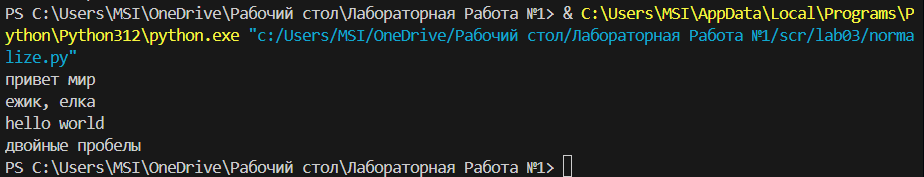
## Задание A.2 
```python
def tokenize(text: str) -> list[str]:
    for i in ",!😀":
        text=text.replace(i,"")
    text=text.strip()
    text=text.split()
    return text
print(tokenize("привет мир"))
print(tokenize("hello,world!!!"))
print(tokenize("по-настоящему круто"))
print(tokenize("2025 год"))
print(tokenize("emoji 😀 не слово"))
```
Исключаю все ненужные комбинации и присваиваю им значение i, если i находится в строке, то заменяю его на пробел. После чего удаляю все енужные пробелы слева и справа с помощью фукнции strip. Добавяю мои мои слова в массив при помощи функции split(не прописываю ему критерий т.к критерий это пробел, а он по умоляанию).
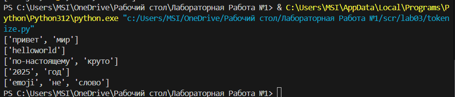
## Задание A.3
```python
def count_freq(tokens: list[str]) -> dict[str, int]:
    f=[]
    d=[]
    g=[]
    k=set(tokens)
    for i in k:
       m=tokens.count(i)
       g.append(f"{i}:{m}")
    return f" Частота {sorted(g)}",f" Топ - 2 слов {sorted(g[:2])}"
print(count_freq(["a","b","a","c","b","a"]))
```
В данном коде создаю цикл и пробегаюсь по уникальным элементам массива. Цикл берет одно значение из сетового массива и ищет его в начальном массиве. С помощью функции count записывает сколько раз встречался тот символ, а позже добавляет этот элемент и его количество в новый массив через двоеточие. Чтобы отсортировать по алфавиту использую функцию sorted.
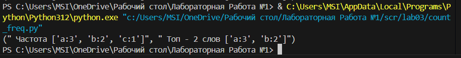
## Задание А.4
```python
def top_n(freq: dict[str, int], n: int = 5) -> list[tuple[str, int]]:
    sorted_items = sorted(freq.items(), key=lambda x: (-x[1], x[0]))
    return sorted_items[:n]
print(count_freq(["bb","aa","bb","aa","cc"]))
```
В коде используется словарь - dict, с его помощью подсчитываю количество вхождений определенного слова в массив, далее с помощью лямбд после нее пишу икс, это некая переменная которая поможет передвигаться по массиву, выбираю -x[1] это значит что я пойду по убыванию, x[0] это мое слово.
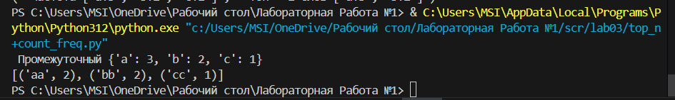
В задании 
## Задание B.1
```python
def text_stats(tokens: list[str]) -> dict[str, int]:
    h=[]
    g=[]
    p=[]
    for i in ("!,."):
        tokens=tokens.replace(i," ")
    s=tokens.split()
    for i in s: 
       g.append(i)
       f=set(g)
    for i in f:
        m=tokens.count(i)
        p.append(f"{i}:{m}")
    k=p
    r=[i.split(':') for i in k]
    for i in r:
        l=i[-1],i[:1]
        h.append([l])
    return f"Всего слов - {len(g)}",f"Уникальных слов - {len(p)}",f" Топ слов - {(h)}"
print(text_stats("Привет, ура, ура Привет Привет !!!"))
```
В данном коде использую фишки прошлых заданий, такие как: 1. Исключение одинаковых элементов из массива, 2. Нахождение Количества конкретного символа в массиве.
Строчка - r=[i.split(':') for i in k] , цикл который пробегается по i элменту, если он находит ":" то происходит сплит, Элементы записываются в новый массив.
Далее пробегаюсь по элементам массивов в новом массиве. В return пишу количество слов, в моем случае оно равно длине массива g, в который добавлены все слова начального массива.


### Лабораторная работа №4 ###

## Задание A. io_txt_csv.py ##
```python
import csv
from pathlib import Path
from typing import Iterable, Sequence

def read_text(path: str | Path, encoding: str = "utf-8") -> str:
    """
    Читает текстовый файл и возвращает его содержимое как строку.
    
    Args:
        path: Путь к файлу
        encoding: Кодировка файла (по умолчанию UTF-8)
        
    Returns:
        Содержимое файла как строка
        
    Raises:
        FileNotFoundError: Если файл не существует
        UnicodeDecodeError: Если возникли проблемы с декодированием
    """
    p = Path(path)
    return p.read_text(encoding=encoding)


def write_csv(rows: Iterable[Sequence], path: str | Path, 
              header: tuple[str, ...] | None = None) -> None:
    """
    Записывает данные в CSV файл.
    
    Args:
        rows: Итерируемый объект с данными для записи
        path: Путь для сохранения CSV файла
        header: Заголовок столбцов (опционально)
        
    Raises:
        ValueError: Если строки имеют разную длину
    """
    p = Path(path)
    rows_list = list(rows)

    # Проверяем одинаковую длину всех строк
    if rows_list:
        first_len = len(rows_list[0])
        for i, row in enumerate(rows_list):
            if len(row) != first_len:
                raise ValueError 
    # Создаем родительские директории если нужно
    p.parent.mkdir(parents=True, exist_ok=True)
    
    with p.open("w", newline="", encoding="utf-8") as f:
        writer = csv.writer(f)
        if header is not None:
            writer.writerow(header)
        writer.writerows(rows_list)


def ensure_parent_dir(path: str | Path) -> None:
    """
    Создает родительские директории для указанного пути если они не существуют.
    
    Args:
        path: Путь к файлу
    """
    p = Path(path)
    p.parent.mkdir(parents=True, exist_ok=True)
```

## Задание B. text_report.py ##
```python
import argparse
import sys
from pathlib import Path

# Добавляем корневую папку в Python path
project_root = Path(__file__).parent.parent.parent
sys.path.insert(0, str(project_root))

# Импортируем модули
from src.lib.text import normalize, tokenize, count_freq, top_n, sorted_word_counts
from src.lab04.io_txt_csv import read_text, write_csv


def frequencies_from_text(text: str) -> dict[str, int]:
    """Вычисляет частоты слов из текста."""
    tokens = tokenize(normalize(text))
    return count_freq(tokens)


def generate_report(input_file: str, output_file: str) -> None:
    """Генерирует отчет по словам из входного файла."""
    # Читаем текст из файла
    text = read_text(input_file)
    
    # Вычисляем частоты
    freq = frequencies_from_text(text)
    
    # Сортируем слова по частоте
    sorted_words = sorted_word_counts(freq)
    
    # Записываем в CSV
    write_csv(sorted_words, output_file, header=("word", "count"))
    
    # Выводим статистику в консоль
    total_words = sum(freq.values())
    unique_words = len(freq)
    top_5 = top_n(freq, 5)
    
    print(f"Всего слов: {total_words}")
    print(f"Уникальных слов: {unique_words}")
    print("Топ-5 слов:")
    for word, count in top_5:
        print(f"  {word}: {count}")
    
    print(f"\nОтчет сохранен в: {output_file}")


def main():
    """Основная функция скрипта."""
    parser = argparse.ArgumentParser(description='Генерация отчета по статистике слов')
    parser.add_argument('--in', dest='input_file', default='data/lab04/input.txt',
                       help='Входной текстовый файл')
    parser.add_argument('--out', dest='output_file', default='data/lab04/report.csv',
                       help='Выходной CSV файл')

    args = parser.parse_args()
    
    # Проверяем существование входного файла
    input_path = Path(args.input_file)
    if not input_path.exists():
        print(f"Ошибка: Входной файл '{args.input_file}' не найден")
        print(f"Полный путь: {input_path.absolute()}")
        return
 
    generate_report(args.input_file, args.output_file)

if __name__ == "__main__":
    main()
```
 # Тест кейс № 1: Рандомный текст: #
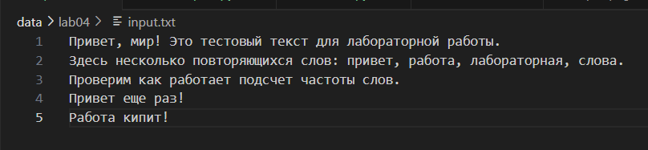
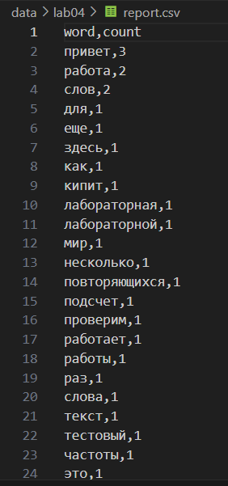

 # Тест кейс № 2: Исходное предложение: #
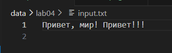
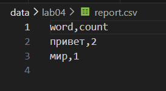

### Лабораторная работа №5 ###
## Задание A (CSV <---> JSON) ##
```python
import json, csv
from pathlib import Path

def json_to_csv(json_path: str, csv_path: str) -> None:

    json_file = Path("src/data/samples/people.json")

    if not json_file.exists():
        raise FileNotFoundError('Файл не найден')
    if json_file.suffix.lower() != '.json':
        raise ValueError('Не json')
    
    with open(json_path,'r', encoding='utf-8') as f:
        data_json = json.load(f)

    with open(csv_path,'w', encoding ='utf-8') as f:
        write = csv.DictWriter(f,fieldnames=data_json[0])
        write.writeheader()
        write.writerows(data_json)


def csv_to_json(csv_path: str, json_path: str) -> None:
    csv_file = Path("src/data/samples/people.csv")

    if not csv_file.exists():
        raise FileNotFoundError('Файл не найден')
    if csv_file.suffix.lower() != '.csv':
        raise ValueError('Не csv')
    
    with open(csv_path,'r',encoding ='utf-8') as f:
        reader = csv.DictReader(f)
        data = list(reader)

    with open(json_path,'w',newline="",encoding = 'utf-8') as f:
        json.dump(data,f, ensure_ascii=False, indent=2)


csv_to_json("src/data/samples/people.csv","src/data/out/people_from_csv.json") 
json_to_csv("src/data/samples/people.json", "src/data/out/people_from_json.csv")
```
# Тест кейс: #
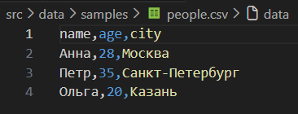
.png)
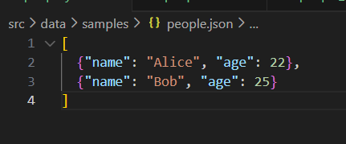
.png)
## Задание B (CSV <---> XLSX) ##
```python
import csv

from openpyxl import Workbook

def csv_to_xlsx(csv_path: str, xlsx_path: str) -> None:
    wb = Workbook()
    ws = wb.active
    ws.title = "Sheet1"

    with open(csv_path,'r',encoding="utf-8") as f:
         read = csv.reader(f)
         for row in read:
              ws.append(row)
        
    for column in ws.columns:
        column_letter = column[0].column_letter  # Получаем букву колонки (A, B, C...)
        max_length = 8  # Минимальная ширина
        
        for cell in column:
            if cell.value:
                # Ищем самую длинную строку в колонке
                max_length = max(max_length, len(str(cell.value)))
        
        # Устанавливаем ширину колонки
        ws.column_dimensions[column_letter].width = max_length + 2
    
    wb.save(xlsx_path)
          
csv_to_xlsx('src\data\samples\people.csv','src\data\out\people.xlsx')
```
# Тест кейс: #

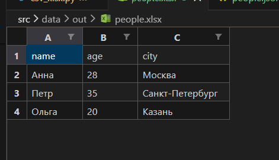

### Лабораторная работа №6 ###
## Задание №1 - cli_text.py ##
```python
import argparse
from pathlib import Path
from functions import normalize, tokenize, count_freq, top_n


def read_text(path: str | Path, encoding: str = "utf-8") -> str:
    if not (isinstance(path, (str, Path))):
        raise TypeError(f"Неверный тип path type={type(path)}, должно быть str/Path")
    if not (isinstance(encoding, str)):
        raise TypeError(f"Неверный тип encoding type={type(encoding)}, должно быть str")
    path = Path(path)

    if not (path.exists()):
        raise FileNotFoundError("Файл не найден")
    try:
        return path.read_text(encoding=encoding)
    except:
        raise UnicodeDecodeError("Неверная кодировка файла")


def main():
    parser = argparse.ArgumentParser(description="CLI‑утилиты лабораторной №6")
    subparsers = parser.add_subparsers(dest="command")

    # подкоманда cat
    cat_parser = subparsers.add_parser("cat", help="Вывести содержимое файла")
    cat_parser.add_argument("--input", required=True)
    cat_parser.add_argument("-n", action="store_true", help="Нумеровать строки")

    # подкоманда stats
    stats_parser = subparsers.add_parser("stats", help="Частоты слов")
    stats_parser.add_argument("--input", required=True)
    stats_parser.add_argument("--top", type=int, default=5)

    args = parser.parse_args()

    if args.command == "cat":
        cat_input = args.input
        cat_n = args.n
        i_stroka = 1
        cat_input = Path(cat_input)
        if not (cat_input.exists()):
            raise FileNotFoundError("Файл не найден")
        try:
            with cat_input.open("r", encoding="utf-8") as d:
                if cat_n:
                    for line in d.readlines():
                        print(f"{i_stroka} строка: {line}", end="")
                        i_stroka += 1
                else:
                    for line in d.readlines():
                        print(f"{line}", end="")
        except:
            raise UnicodeDecodeError("Не удалось прочитать файл")
            """ Реализация команды cat """
    elif args.command == "stats":
        stars_input = args.input
        stats_top_n = args.top
        stars_input = Path(stars_input)
        if not (stars_input.exists()):
            raise FileNotFoundError(f"Файл не найден по пути {stars_input}")
        try:
            text = read_text(path=stars_input)
        except:
            raise UnicodeEncodeError("Ошибка чтения файла")
        if not (type(stats_top_n) == int):
            raise TypeError(f"Ошибка type(n) = {type(stats_top_n)}, а должен быть int")

        text_normalize = normalize(text)
        text_tokenize = tokenize(text_normalize)
        text_freq = count_freq(text_tokenize)
        text_top = top_n(text_freq, stats_top_n)
        print("word", "count")
        for word, count in text_top:
            print(word, count)
        """ Реализация команды stats """


main()
```
## Задание №2 - cli_convert.py ##
```python
import argparse
from functions import csv_to_json, json_to_csv, csv_to_xlsx
from pathlib import Path


def main():
    parser = argparse.ArgumentParser(description="Конвертеры данных")
    sub = parser.add_subparsers(dest="cmd")

    p1 = sub.add_parser("json2csv", help="Конвертировать JSON в CSV")
    p1.add_argument(
        "--input", dest="input", required=True, help="Путь к входному JSON файлу"
    )
    p1.add_argument(
        "--output", dest="output", required=True, help="Путь для сохранения CSV файла"
    )

    p2 = sub.add_parser("csv2json", help="Конвертировать CSV в JSON")
    p2.add_argument(
        "--input",
        dest="input",
        required=True,
        help="Путь к входному CSV файлу (с заголовком в первой строке)",
    )
    p2.add_argument(
        "--output", dest="output", required=True, help="Путь для сохранения JSON файла"
    )

    p3 = sub.add_parser("csv2xlsx", help="Конвертировать CSV в XLSX")
    p3.add_argument(
        "--input", dest="input", required=True, help="Путь к входному CSV файлу"
    )
    p3.add_argument(
        "--output", dest="output", required=True, help="Путь для сохранения XLSX файла"
    )

    args = parser.parse_args()

    """
        Вызываем код в зависимости от аргументов.
    """
    if args.cmd == "json2csv":
        path_in = args.input
        path_ou = Path(args.output)
        json_to_csv(path_in, path_ou)

    elif args.cmd == "csv2json":
        path_in = args.input
        path_ou = Path(args.output)
        csv_to_json(path_in, path_ou)

    elif args.cmd == "csv2xlsx":
        path_in = args.input
        path_ou = Path(args.output)
        csv_to_xlsx(path_in, path_ou)


main()
```
## Пример работы stats в cli_text.py ##
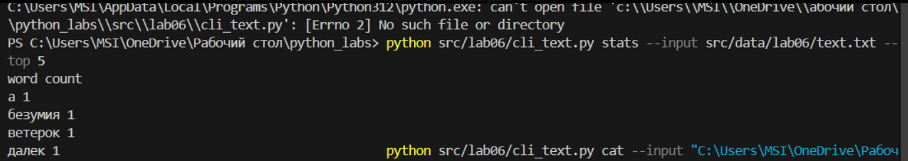
## Пример работы cat в cli_text.py ##
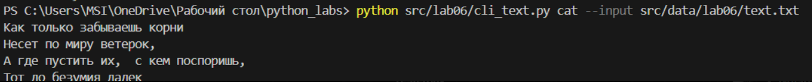
## Запуск нужных функций в cli.convert.py ## 
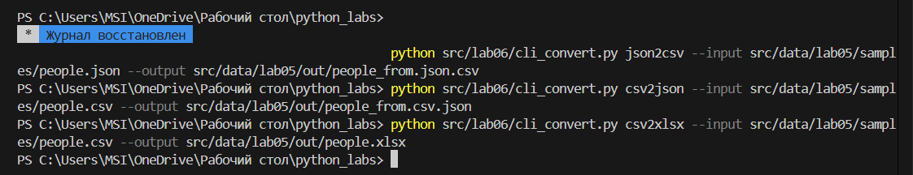
## Результаты работы функций: ## 
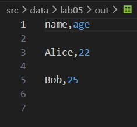
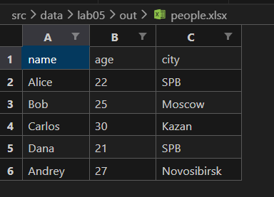
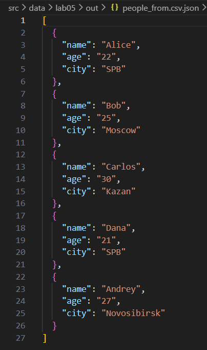

### Лабораторная работа №7 ###

## Задание 1 — test_text.py ##
```python
import pytest
from functions import normalize, tokenize, count_freq, top_n


@pytest.mark.parametrize(
    "source, expected",
    [
        ("привет\nмир\t", "привет мир"),
        ("ёжик, Ёлка", "ежик, елка"),
        ("hello\r\nworld", "hello world"),
        ("  двойные   пробелы  ", "двойные пробелы"),
    ],
)
def test_normalize(source, expected):
    assert normalize(source) == expected


@pytest.mark.parametrize(
    "source, expected",
    [
        ("привет мир", ["привет", "мир"]),
        ("hello,world!!!", ["hello", "world"]),
        ("по-настоящему круто", ["по-настоящему", "круто"]),
        ("2025 год", ["2025", "год"]),
        ("", []),  # пустая строка
        ("   ", []),  # только пробелы
        ("!!!@@@###", []),  # только спецсимволы
        ("раз два.три,четыре!пять?", ["раз", "два", "три", "четыре", "пять"]),
        ("цифры123 и символы!", ["цифры123", "и", "символы"]),
    ],
)
def test_tokenize(source, expected):
    assert tokenize(source) == expected


@pytest.mark.parametrize(
    "source, expected",
    [
        (["apple", "apple", "banana"], {"apple": 2, "banana": 1}),
        (["a", "b", "a", "c", "c"], {"a": 2, "b": 1, "c": 2}),
        ([], {}),  # пустой список
        (["x"], {"x": 1}),  # один элемент
        (["lol", "lol", "lol"], {"lol": 3}),  # все одинаковые
        (["4", "6", "8"], {"4": 1, "6": 1, "8": 1}),  # все разные
    ],
)
def test_count_freq(source, expected):
    assert count_freq(source) == expected


@pytest.mark.parametrize(
    "freq, n, expected",
    [
        ({"pineapple": 2, "apple": 1}, 1, [("pineapple", 2)]),
        ({"a": 5, "b": 5, "c": 3}, 2, [("a", 5), ("b", 5)]),  # ничья
        ({"x": 1}, 1, [("x", 1)]),  # один элемент
        ({}, 5, []),  # пустой словарь
        ({"a": 10, "b": 10, "c": 10}, 2, [("a", 10), ("b", 10)]),  # все одинаковые
        ({"z": 1, "y": 2, "x": 3}, 2, [("x", 3), ("y", 2)]),  # проверка порядка
    ],
)
def test_top_n(freq, n, expected):
    assert top_n(freq, n) == expected
``` 
# Результаты теста: #

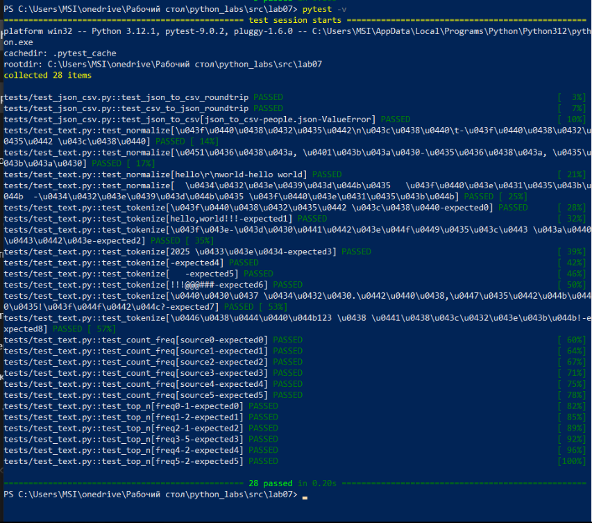

## Задание 2 — test_json_csv.py ##
```python 
import pytest
from functions import json_to_csv, csv_to_json
from pathlib import Path
import csv
import json


def test_json_to_csv_roundtrip(tmp_path: Path):
    scr = tmp_path / "people.json"
    dst = tmp_path / "people.csv"
    data = [
        {"name": "Alice", "age": 22},
        {"name": "Bob", "age": 25},
    ]
    scr.write_text(json.dumps(data, ensure_ascii=False, indent=2), encoding="utf-8")
    json_to_csv(str(scr), str(dst))
    with dst.open(encoding="utf-8") as f:
        rows = list(csv.DictReader(f))
    assert len(rows) == 2
    assert {"name", "age"} <= set(rows[0].keys())


def test_csv_to_json_roundtrip(tmp_path: Path):
    scr = tmp_path / "people.csv"
    dst = tmp_path / "people.json"
    data = [
        {"name": "Alice", "age": "22"},
        {"name": "Bob", "age": "25"},
    ]
    with open(scr, "w", newline="", encoding="utf-8") as f:
        fieldnames = list(data[0].keys())
        writer = csv.DictWriter(f, fieldnames=fieldnames)
        writer.writeheader()
        writer.writerows(data)
    csv_to_json(str(scr), str(dst))
    with dst.open(encoding="utf-8") as f:
        rows = json.load(f)
    assert len(rows) == 2


@pytest.mark.parametrize(
    "function, input_file, error",
    [
        (json_to_csv, "people.json", ValueError),
    ],
)
def test_json_to_csv(function, input_file, error, tmp_path: Path):
    file_path = tmp_path / input_file
    file_path.write_text("Error???", encoding="utf-8")
    dst = tmp_path / "people.csv"
    f = json_to_csv if function is json_to_csv else csv_to_json
    with pytest.raises(error):
        f(str(file_path), str(dst))
```
# Результаты теста: #
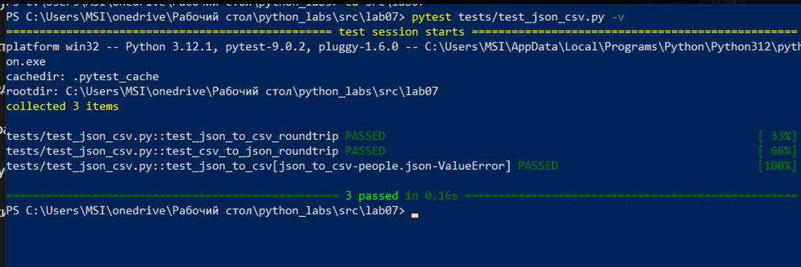

# Стиль кода "Black" #
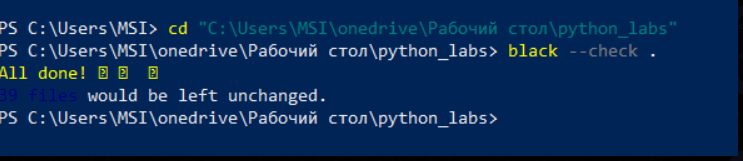

# Лабораторная работа №8 #

## models.py ## 
```python
from dataclasses import dataclass
from datetime import datetime, date


@dataclass
class Student:
    fio: str
    birthdate: str
    group: str
    gpa: float

    def __post_init__(self):
        # Валидация формата даты
        try:
            datetime.strptime(self.birthdate, "%Y-%m-%d")
        except ValueError:
            raise ValueError(
                f"Неверный формат: {self.birthdate}. Ожидается формат: YYYY-MM-DD"
            )

        # Валидация диапазона GPA
        if not (0 <= self.gpa <= 5):
            raise ValueError(f"Gpa должен быть от 0 до 5 {self.gpa}")

    def age(self) -> int:
        birth_date = datetime.strptime(self.birthdate, "%Y-%m-%d").date()
        today = date.today()

        # Вычисляем возраст
        age = today.year - birth_date.year

        # Если день рождения в этом году еще не наступил, вычитаем 1 год
        if (today.month, today.day) < (birth_date.month, birth_date.day):
            age = age - 1

        return age

    def to_dict(self) -> dict:
        # Проверяем, что все поля корректны
        if not all([self.fio, self.birthdate, self.group]):
            raise ValueError("Все поля должны быть заполнены")

        return {
            "fio": self.fio,
            "birthdate": self.birthdate,
            "group": self.group,
            "gpa": self.gpa,
        }

    @classmethod
    def from_dict(cls, d: dict):
        # Десереализация из словаря
        return cls(
            fio=d["fio"], birthdate=d["birthdate"], group=d["group"], gpa=d["gpa"]
        )

    def __str__(self):
        # Вывод
        return f"{self.fio}, группа {self.group}, возраст {self.age()}, GPA: {self.gpa}"
```
## serialize.py ##
```python
import json
from typing import List
from models import Student


def students_to_json(students: List[Student], path: str):
    data = [s.to_dict() for s in students]
    with open(path, "w", encoding="utf-8") as f:
        json.dump(data, f, ensure_ascii=False, indent=2)


def students_from_json(
    path: str,
) -> List[Student]:  # Читает JSON-массив и создаёт список Student с валидацией
    # path: путь к JSON файлу
    # List[Student]: список объектов Student
    # ValueError: если данные в файле невалидны
    try:
        with open(path, "r", encoding="utf-8") as f:
            data = json.load(f)
    except FileNotFoundError:
        raise FileNotFoundError(f"Файл {path} не найден")
    except json.JSONDecodeError:
        raise ValueError(f"Файл {path} содержит некорректный JSON")

    if not isinstance(data, list):
        raise ValueError("JSON должен содержать массив объектов")

    students = []
    for i, item in enumerate(data):
        try:
            required_fields = [
                "fio",
                "birthdate",
                "group",
                "gpa",
            ]  # проверяем обязательные поля
            for field in required_fields:
                if field not in item:
                    raise ValueError(
                        f"Отсутствует обязательное поле '{field}' в элементе {i}"
                    )

            student = Student.from_dict(item)
            students.append(student)
        except ValueError as e:
            raise ValueError(f"Ошибка валидации в элементе {i}: {e}")
        except Exception as e:
            raise ValueError(f"Неожиданная ошибка в элементе {i}: {e}")
    return students
```
# functions_check.py # 
```python
from serialize import students_to_json, students_from_json
import json
import os


class Config:
    BASE_DIR = "src/data/lab_08"
    INPUT_FILE = os.path.join(BASE_DIR, "students_input.json")
    OUTPUT_FILE = os.path.join(BASE_DIR, "students_output.json")


def create_input_file():
    if not os.path.exists(Config.INPUT_FILE):  # создает students_input.json
        sample_data = [
            {
                "fio": "Машков василий Серггеевич",
                "birthdate": "2007-12-29",
                "group": "BIVT-03",
                "gpa": 4.5,
            },
            {
                "fio": "Тарасов Михаил Ярославович",
                "birthdate": "2006-05-12",
                "group": "BIVT-02",
                "gpa": 4.8,
            },
            {
                "fio": "Большакова Камила Никитична",
                "birthdate": "1992-01-11",
                "group": "BIVT-10",
                "gpa": 2.3,
            },
            {
                "fio": "Кузнецов Роман Адамович",
                "birthdate": "2010-09-14",
                "group": "BIVT-12",
                "gpa": 3.2,
            },
        ]
        with open(Config.INPUT_FILE, "w", encoding="utf-8") as f:
            json.dump(sample_data, f, ensure_ascii=False, indent=2)

        print(f"Создан файл {Config.INPUT_FILE} с тестовыми данными")
    return Config.INPUT_FILE


def main():
    print("Думаем")

    # Создаем файл students_input.json
    create_input_file()

    # Загружаем студентов
    try:
        students = students_from_json(Config.INPUT_FILE)  # Используем Config
        print(f"Загружено: {len(students)} студентов")
        for s in students:
            print(f"  - {s}")
    except Exception as e:
        print(f"Ошибка загрузки: {e}")
        return

    # Сохраняем студентов
    try:
        students_to_json(students, Config.OUTPUT_FILE)  # Используем Config
        print(f"Сохранено в {Config.OUTPUT_FILE}")
    except Exception as e:
        print(f"Ошибка сохранения: {e}")
        return


if __name__ == "__main__":
    main()
```
### После запуска: ### 
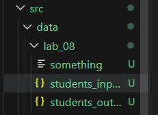

### Запуск терминала: ###
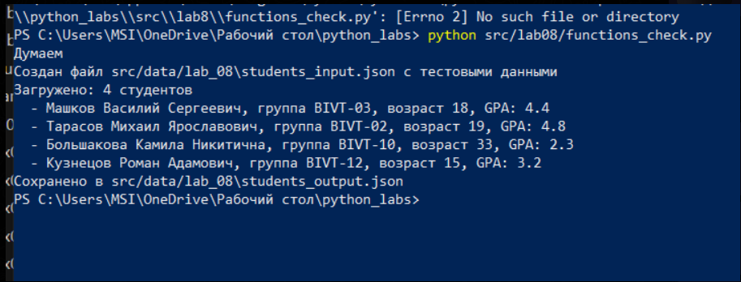

### students_input.py ###
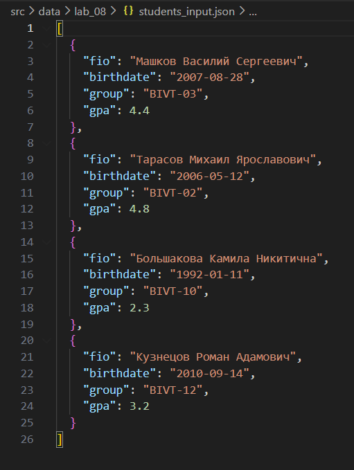

### students_output.py ### 
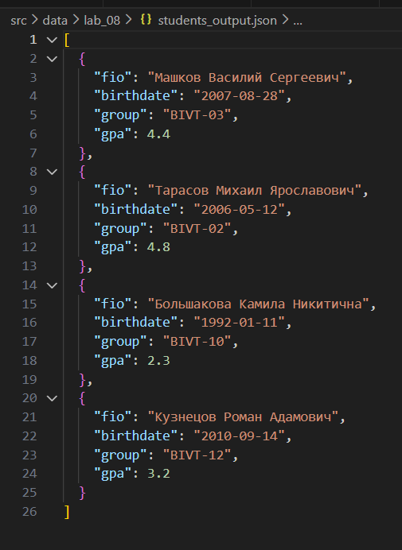
