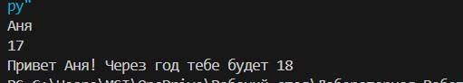
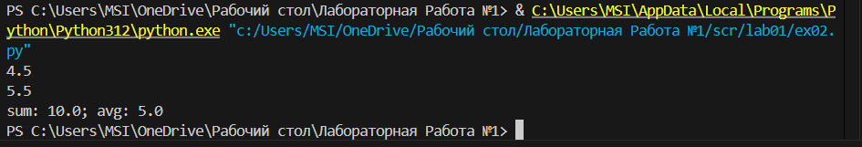
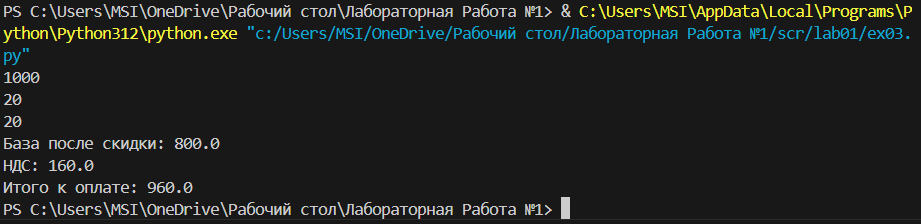

# **Лабораторная работа №1**
## Задание 1
```python
print(f'Привет {input()}! Через год тебе будет {int(input()) + 1}')
```

## Задание 2 
```python
a, b = float(input()), float(input())
print(f'sum: {a + b}; avg: {(a + b) / 2}')
```
Функция Float - служит для хранения типа данных с плавающей точкой 

## Задание 3 
```python
price = float(input())
discount = float(input())
vat = float(input())

base = price * (1 - discount / 100)
vat_amount = base * (vat / 100)
total = base + vat_amount

print(f'База после скидки: {base}')
print(f'НДС: {vat_amount}')
print(f'Итого к оплате: {total}')
```
В данном случае base - это цена при скидке, а vat_amount - Цена после скидки с учетом НДС

## Задание 4 
```python
min = int(input())
print(f'{min//60}:{min % 60}')
```


