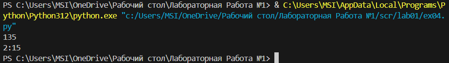

# **Лабораторная работа №1**
## Задание 1
```python
print(f'Привет {input()}! Через год тебе будет {int(input()) + 1}')
```

## Задание 2 
```python
a, b = float(input()), float(input())
print(f'sum: {a + b}; avg: {(a + b) / 2}')
```
Функция Float - служит для хранения типа данных с плавающей точкой 

## Задание 3 
```python
price = float(input())
discount = float(input())
vat = float(input())

base = price * (1 - discount / 100)
vat_amount = base * (vat / 100)
total = base + vat_amount

print(f'База после скидки: {base}')
print(f'НДС: {vat_amount}')
print(f'Итого к оплате: {total}')
```
В данном случае base - это цена при скидке, а vat_amount - Цена после скидки с учетом НДС

## Задание 4 
```python
min = int(input())
print(f'{min//60}:{min % 60}')
```

## Задание 5
```python
fio = input()
con = [i for i in fio if i != ' ']
ini = [g for g in con if g.isupper()]
print(f'Инициалы: {"".join(ini)}')
print(f'Длина (символов): {len(con)}')
```
В коде я расписал два генератора. 
Первый - con - служит для удаления пробелов в строке. Если при пробежке по строке, геник видит пробел, он исключает его из последовательности.
Второй - ini - Служит для определения символа, если символ заглавный, то он остается в строке. 
Функция isupper - служит для выявления заглавной буквы.

## Задание 6
```python
k = int(input())
och = 0
zaoch = 0
for i in range(0, k):
    n = (input().split())
    if 'True' in n:
        och += 1
    else:
        zaoch += 1
print(och, zaoch)
```
В данной задаче split - Разбивает введенные слова на элементы массива, после чего, с помощью генератора мы ищем подходящее слово в этом массиве.

## Задание 7
```python
N = input()
con = 1
name = ''
for i in range(0, len(N)):
    if N[i].isupper():
        name += N[i]
        for j in range(i, len(N)):
            if N[j].isnumeric():
                for k in range(j + 1, len(N), con):
                    name += N[k]
                break
            con += 1
print(name)
```
Функция isupper - ищет заглавную букву в моем массиве, с помощью нее нахожу первую букву зашифрованного сообщения.
Функция isnumeric - ищет число, в моем случае я пробегаюсь от первой буквы моего зашифрованного слова и заканчивая длинной строки, затрагивая все возможные символы. Если следующий символ не цифра, то в таком случае мой счетчик повышается на 1, в задаче прямым текстом сказано, что символы моего зашифрованного слова находятся на определнном расстоянии друг от друга, чем я и пользуюсь.
Если я нахожу цифру, следовательно следующий элемент после цифры - элемент моего зашифрованного слова. 


